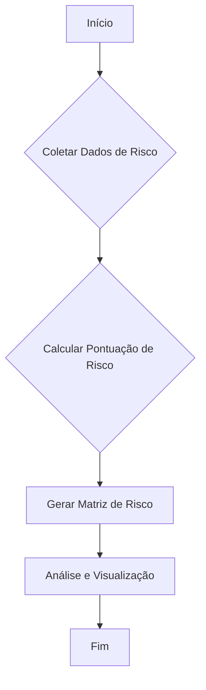
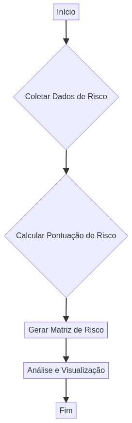
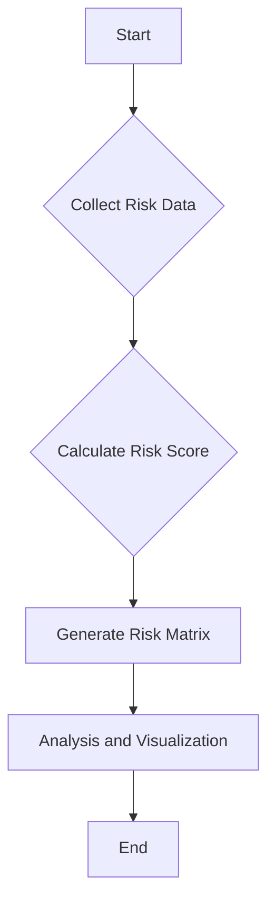

# R-Risk-Assessment

[](docs/LICENSE)
[](https://www.r-project.org/)
[](https://github.com/galafis/R-Risk-Assessment/commits/main)
[](https://github.com/galafis/R-Risk-Assessment/stargazers)

## Avaliação e Gerenciamento de Riscos com R

Este repositório apresenta um conjunto de ferramentas e scripts em R para realizar avaliação e gerenciamento de riscos. O objetivo é fornecer um framework simples e eficaz para calcular pontuações de risco e visualizar matrizes de risco, auxiliando na tomada de decisões estratégicas.

### Funcionalidades

*   **Cálculo de Pontuação de Risco**: Função para calcular a pontuação de risco com base na probabilidade e impacto.
*   **Geração de Matriz de Risco**: Ferramenta para visualizar riscos em uma matriz, destacando áreas de maior preocupação.
*   **Estrutura Profissional**: Organização clara do código, testes e documentação.

### Arquitetura do Sistema

O diagrama abaixo ilustra o fluxo de trabalho do processo de avaliação de risco:





### Como Usar

1.  **Clonar o Repositório**:

    ```bash
    git clone https://github.com/galafis/R-Risk-Assessment.git
    cd R-Risk-Assessment
    ```

2.  **Instalar Dependências (R)**:

    Certifique-se de ter o R instalado. Em seguida, instale os pacotes necessários:

    ```R
    install.packages(c("ggplot2", "dplyr"), repos="http://cran.us.r-project.org")
    ```

3.  **Executar a Análise de Risco**:

    ```bash
    Rscript src/main.R
    ```

    Isso irá gerar um arquivo `risk_matrix.png` na pasta `assets/` com a matriz de risco.

### Testes Unitários

Para executar os testes unitários e validar as funções de cálculo de risco:

1.  **Instalar o pacote `testthat`**:

    ```R
    install.packages("testthat", repos="http://cran.us.r-project.org")
    ```

2.  **Executar os Testes**:

    ```bash
    R -e "library(testthat); test_file(\"tests/test_risk_functions.R\")"
    ```

### Autor

**Gabriel Demetrios Lafis**

Cientista de Dados, Especialista em IA e Engenheiro de Dados com vasta experiência em cibersegurança, desenvolvimento de sistemas e gestão de TI.

### Licença

Este projeto está licenciado sob a Licença MIT - veja o arquivo [LICENSE](docs/LICENSE) para detalhes.

---

# R-Risk-Assessment (English Version)

## Risk Assessment and Management Tools with R

This repository provides a set of R tools and scripts for performing risk assessment and management. The goal is to offer a simple and effective framework for calculating risk scores and visualizing risk matrices, aiding in strategic decision-making.

### Features

*   **Risk Score Calculation**: Function to calculate risk scores based on likelihood and impact.
*   **Risk Matrix Generation**: Tool to visualize risks in a matrix, highlighting areas of greater concern.
*   **Professional Structure**: Clear organization of code, tests, and documentation.

### System Architecture

 The diagram below illustrates the workflow of the risk assessment process:




### How to Use

1.  **Clone the Repository**:

    ```bash
    git clone https://github.com/galafis/R-Risk-Assessment.git
    cd R-Risk-Assessment
    ```

2.  **Install Dependencies (R)**:

    Ensure R is installed. Then, install the necessary packages:

    ```R
    install.packages(c("ggplot2", "dplyr"), repos="http://cran.us.r-project.org")
    ```

3.  **Run the Risk Analysis**:

    ```bash
    Rscript src/main.R
    ```

    This will generate a `risk_matrix.png` file in the `assets/` folder with the risk matrix.

### Unit Tests

To run unit tests and validate the risk calculation functions:

1.  **Install the `testthat` package**:

    ```R
    install.packages("testthat", repos="http://cran.us.r-project.org")
    ```

2.  **Run Tests**:

    ```bash
    R -e "library(testthat); test_file(\"tests/test_risk_functions.R\")"
    ```

### Author

**Gabriel Demetrios Lafis**

Data Scientist, AI Specialist, and Data Engineer with extensive experience in cybersecurity, systems development, and IT management.

### License

This project is licensed under the MIT License - see the [LICENSE](docs/LICENSE) file for details.

